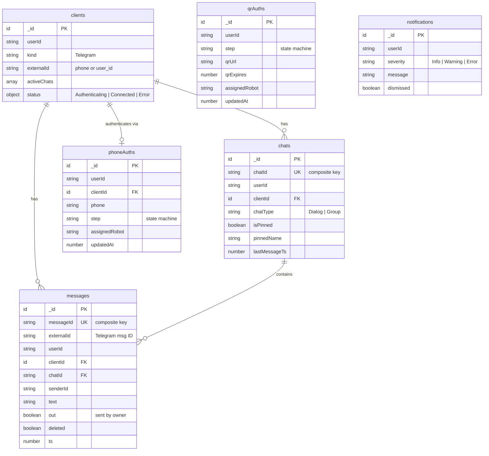
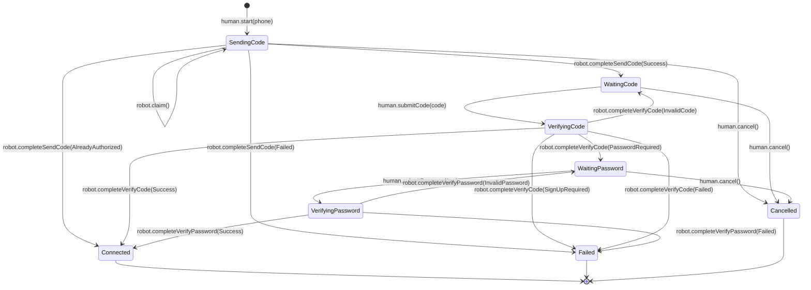
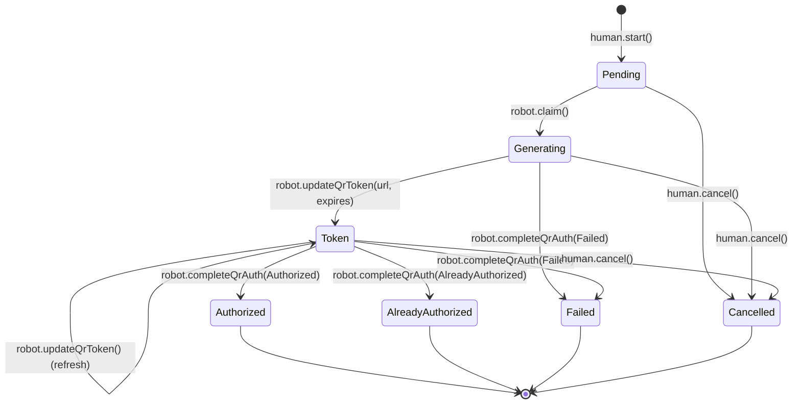
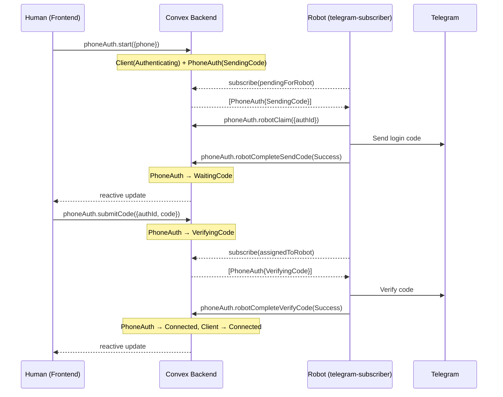

# Convex Backend

Self-hosted Convex backend for CRM Chat. Handles Telegram client authentication, chat/message storage, and real-time subscriptions.

## Data Model

## Authentication

Dual JWT auth system — both validated by the same Clerk provider:

- **Clerk JWTs** — for human users (frontend). Subject: `user_*`.
- **Clerk M2M JWTs** — for worker services (crm-worker). Subject: `mch_*`.

Auth helpers in `helpers/auth.ts`:

| Helper | Purpose |
|--------|---------|
| `requireAuth()` | Extract caller identity, throw if unauthenticated |
| `requireHuman()` | Restrict to Clerk human users |
| `requireWorker()` | Restrict to Clerk M2M workers (`mch_` subject prefix) |
| `isWorkerCaller()` | Check if caller is a worker (no throw) |
| `requireOwner()` | Verify resource ownership (row-level security) |
| `sendError()` | Insert an error notification for a user |

## Phone Auth State Machine

## QR Auth State Machine

## Robot–Human Interaction

## API Reference

### Queries

| Function | Access | Args | Returns | Description |
|----------|--------|------|---------|-------------|
| `clients.list` | Human | — | `ClientDoc[]` | All clients for current user |
| `chats.list` | Human | — | `ChatDoc[]` | Chats sorted by lastMessageTs desc |
| `messages.listByChat` | Human | `chatId` | `MessageDoc[]` | Messages for a chat (ownership verified) |
| `notifications.list` | Human | — | `NotificationDoc[]` | Undismissed notifications |
| `phoneAuth.active` | Human | — | `PhoneAuthPublicDoc[]` | Active phone auths (secrets stripped) |
| `qrAuth.listForUser` | Human | — | `QrAuthDoc[]` | Active + most recent terminal QR auth |
| `qrAuth.active` | Human | — | `QrAuthDoc[]` | Active QR auths only |
| `phoneAuth.pendingForRobot` | Worker | — | `PhoneAuthDoc[]` | Unclaimed phone auths |
| `phoneAuth.assignedToRobot` | Worker | — | `PhoneAuthDoc[]` | Phone auths assigned to caller |
| `qrAuth.pendingForRobot` | Worker | — | `QrAuthDoc[]` | Unclaimed QR auths |
| `qrAuth.assignedToRobot` | Worker | — | `QrAuthDoc[]` | QR auths assigned to caller |

### Mutations

| Function | Access | Description |
|----------|--------|-------------|
| `clients.deleteClient` | Human | Delete client + cancel active phone auths |
| `chats.upsert` | Human/Robot | Create or update a chat |
| `chats.deleteChat` | Human/Robot | Delete a chat |
| `messages.upsert` | Human/Robot | Create or update a message |
| `messages.markDeleted` | Human/Robot | Soft-delete a message |
| `notifications.dismiss` | Human | Dismiss a notification |
| `phoneAuth.start` | Human | Start phone auth flow |
| `phoneAuth.submitCode` | Human | Submit SMS verification code |
| `phoneAuth.submitPassword` | Human | Submit 2FA password |
| `phoneAuth.cancel` | Human | Cancel phone auth |
| `phoneAuth.robotClaim` | Worker | Claim a pending phone auth |
| `phoneAuth.robotCompleteSendCode` | Worker | Report SMS send result |
| `phoneAuth.robotCompleteVerifyCode` | Worker | Report code verification result |
| `phoneAuth.robotCompleteVerifyPassword` | Worker | Report password verification result |
| `qrAuth.start` | Human | Start QR auth flow |
| `qrAuth.cancel` | Human | Cancel QR auth |
| `qrAuth.robotClaim` | Worker | Claim a pending QR auth |
| `qrAuth.robotUpdateQrToken` | Worker | Provide QR code URL |
| `qrAuth.robotCompleteQrAuth` | Worker | Report QR auth result |
