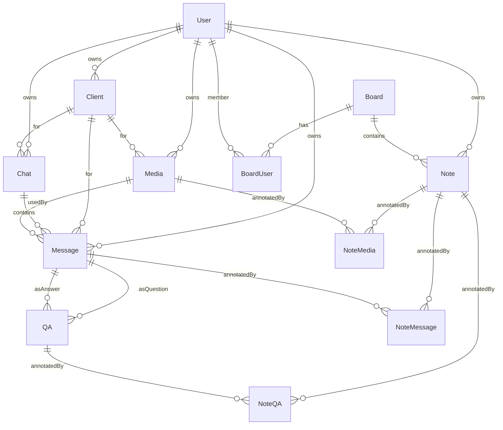

## CRM Chat - SpaceTimeDB Schema and RLS

References: [HTTP Authorization](https://spacetimedb.com/docs/http/authorization/), [SpacetimeAuth](https://spacetimedb.com/docs/spacetimeauth/), [Row Level Security](https://spacetimedb.com/docs/rls/)

### Entity-Relationship (ER) Diagram

### Tables

- user(id: Identity PK)
- client(id: u64 PK, owner_user_id: Identity, kind: ClientKind, external_id UNIQUE)
- chat(id: u64 PK, owner_user_id, client_id, chat_type, external_chat_id, last_message_ts)
- board(id: u64 PK, title, created_at)
- board_user(id: u64 PK, board_id, user_id, UNIQUE(board_id, user_id))
- note(id: u64 PK, owner_user_id, board_id?, message_id?, media_id?, qa_id?, text?, x,y,z,width,height,color?)
- media(id: u64 PK, owner_user_id, client_id, kind, url)
- message(id: u64 PK, owner_user_id, client_id, chat_id, text?, out, deleted, ts, media_id?)
- qa(id: u64 PK, owner_user_id, question_message_id, answer_message_id, confidence?, UNIQUE(question_message_id, answer_message_id))

Composite index examples:
- message: (chat_id, ts)

### RLS overview

Public tables with row-level filters. A row is visible if it is owned by the requester, or is shared via a board membership (directly via `board_id` on the row, or indirectly via a `note` referencing the row and linked to a board the requester belongs to).

Notes:
- Ensure btree indexes exist for `owner_user_id`, `board_id`, and `id` to keep subscriptions valid and performant.

