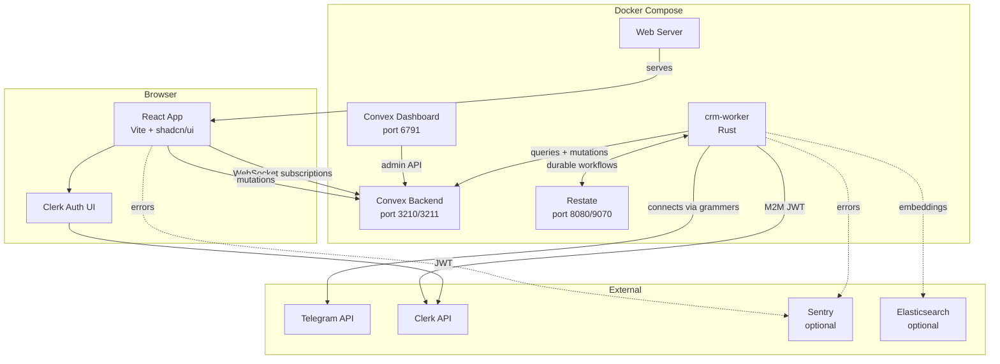
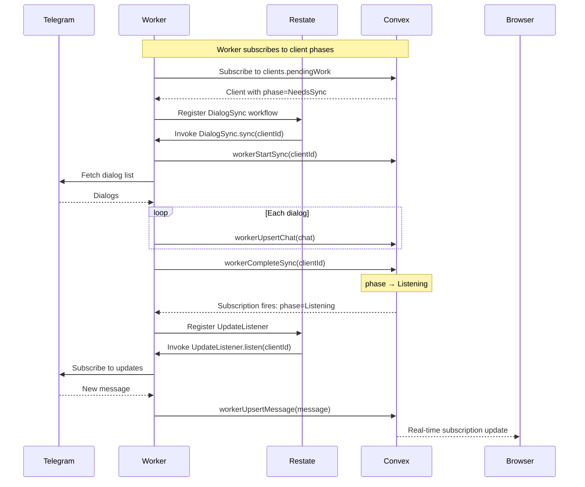
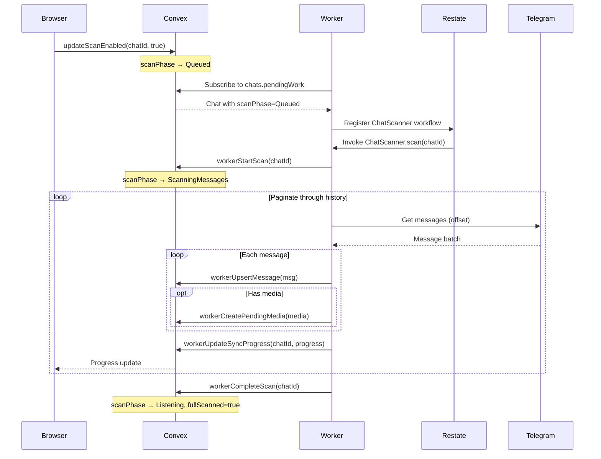
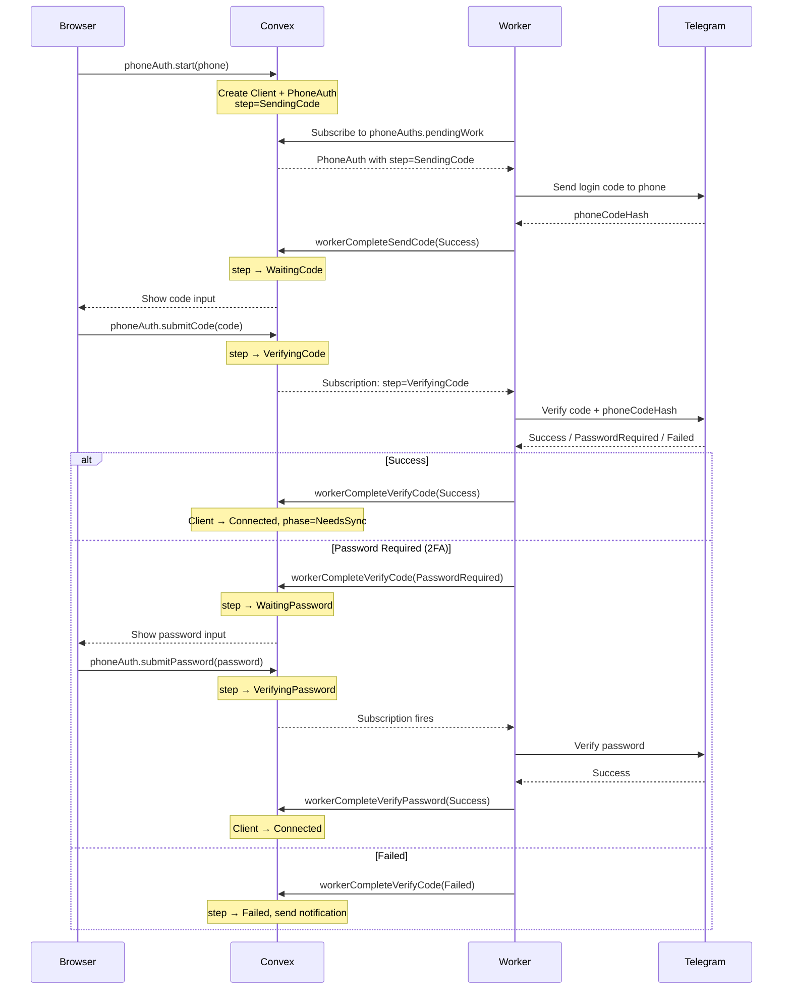
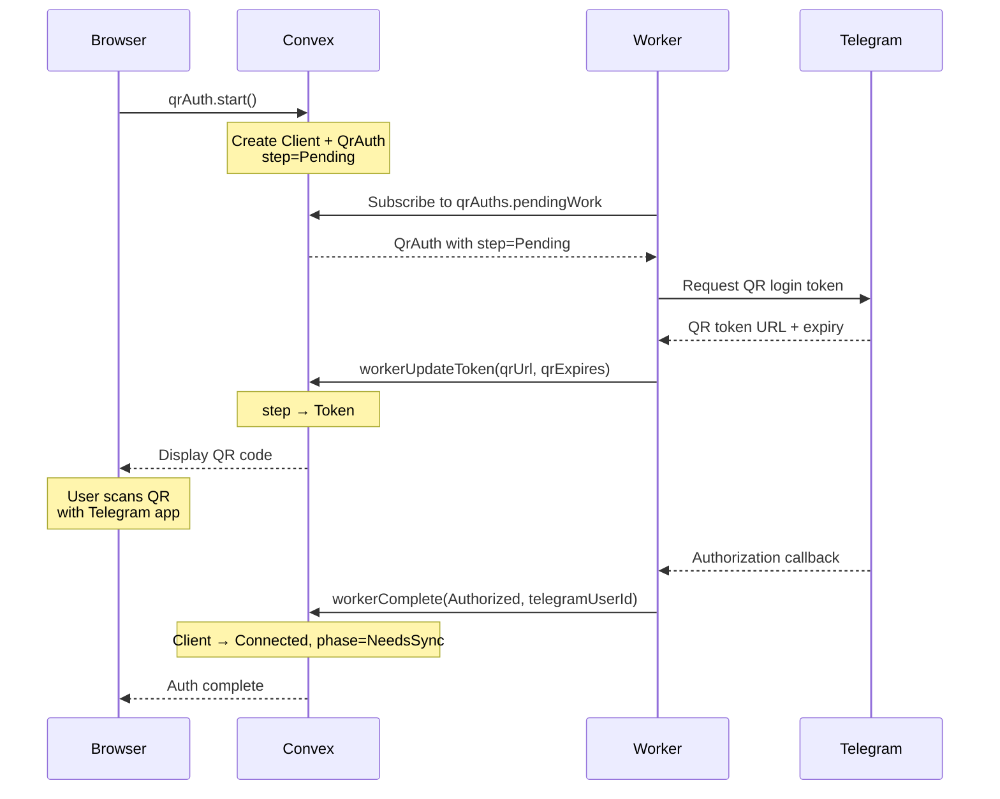
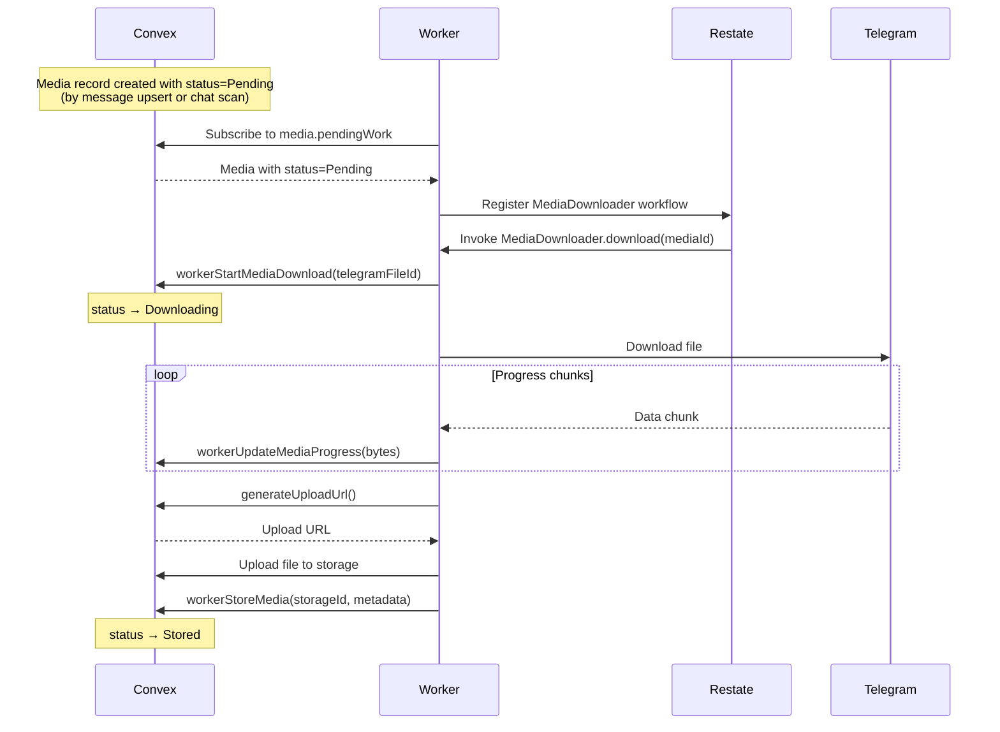
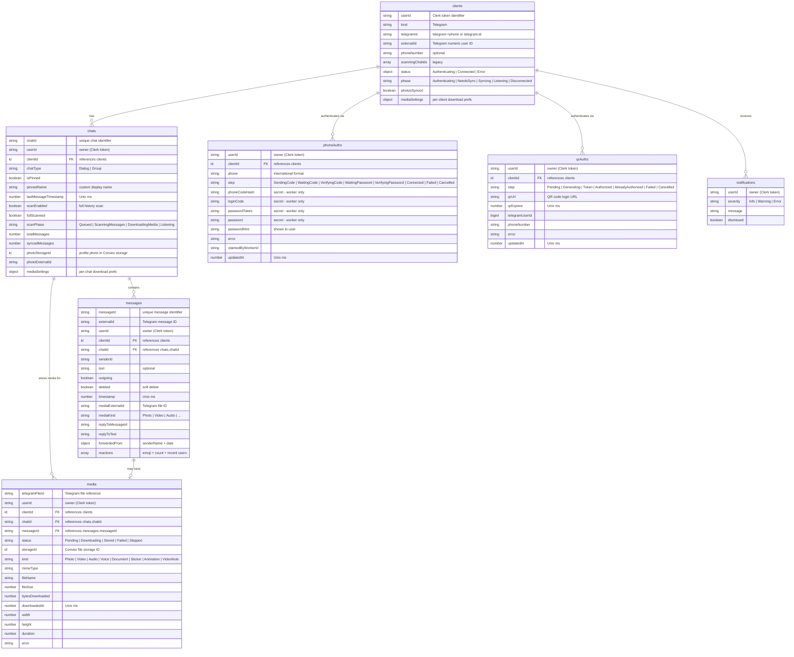
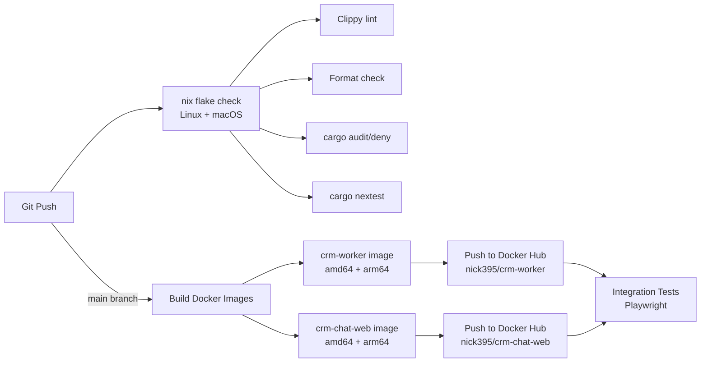

# CRM Chat — Architecture

## System Architecture

## Components

### Frontend (`bins/crm-chat-web`)

React single-page application built with Vite.

- **Convex React SDK** — real-time data subscriptions via `useQuery()` and mutations via `useMutation()`
- **Clerk** — user authentication, wrapped in `ConvexProviderWithClerk`
- **TanStack Router** — file-based routing
- **shadcn/ui** — UI component library (Radix UI primitives)
- **React Compiler** — automatic memoization (no manual `useMemo`/`useCallback`)
- **Ultracite** — Biome-based linting and formatting

### Convex Backend (`bins/convex-backend`)

Self-hosted Convex instance serving as the database, function runtime, and file storage.

- **Schema** defined in `convex/schema.ts` with table definitions in `convex/model/`
- **Dual auth**: Clerk JWTs for humans, Clerk M2M JWTs for the worker
- Auth helpers (`requireHuman()`, `requireWorker()`) enforce access control per-function
- **Domain-driven dispatch**: state changes in the database trigger worker actions via Convex subscriptions (no explicit task queues)

### Worker (`bins/crm-worker`)

Rust service that bridges Telegram and Convex.

- Connects to Convex via the Rust SDK and subscribes to queries
- Uses **grammers** (Rust Telegram client library) for Telegram connections
- Registers with **Restate** for durable workflow execution
- Services: `DialogSync`, `ChatScanner`, `MediaDownloader`, `UpdateListener`, `ProfilePhotoSync`, `PhoneAuthWorkflow`, `QrAuthWorkflow`

### Restate

Durable workflow orchestration engine. The worker registers its services with Restate, which handles:

- Reliable invocation with automatic retries
- Workflow state persistence across restarts
- Concurrency control (e.g., `MAX_MEDIA_WORKFLOWS`)

### Shared Libraries

| Library | Path | Purpose |
|---------|------|---------|
| `messanger-interface` | `libs/messanger-interface` | Platform-agnostic messenger traits (`MessengerClient`, `ChatSummary`, `MessageSummary`) |
| `messanger-telegram` | `libs/messanger-telegram` | Telegram implementation using grammers |
| `hack` | `libs/hack` | Shared utilities |
| `convex-typegen` | `libs/convex-typegen` | Generates Rust types from `convex/schema.ts` |

## Data Flow

### Message Sync Flow

### Chat Scanning Flow

### Phone Authentication Flow

### QR Code Authentication Flow

### Media Download Flow

## Database Schema

## Domain-Driven Dispatch

CRM Chat uses a **domain-driven dispatch** pattern instead of explicit task queues. The pattern works as follows:

1. **State change**: A mutation updates a record's phase/status/step (e.g., `client.phase = "NeedsSync"`)
2. **Reconciler query**: The worker subscribes to `pendingWork` queries that scan for records in actionable states
3. **Workflow dispatch**: When the subscription fires, the worker registers a Restate workflow for the work item
4. **Completion**: The workflow updates the record's state to its next phase, which may trigger further work

This pattern provides:
- **Consistency**: The database is the single source of truth for what needs doing
- **Idempotency**: Re-reading the query after a restart rediscovers incomplete work
- **Cancellation**: Setting a terminal state (e.g., `Cancelled`, `Disconnected`) causes cancel-watcher subscriptions to fire, stopping active workflows

### Reconciler Work Items

| Source | Service | Trigger State | Action |
|--------|---------|---------------|--------|
| `clients.pendingWork` | `DialogSync` | `phase=NeedsSync` | Sync Telegram dialog list |
| `clients.pendingWork` | `UpdateListener` | `phase=Listening` | Subscribe to real-time updates |
| `clients.pendingWork` | `ProfilePhotoSync` | `phase=Listening, photosSynced=false` | Download contact photos |
| `chats.pendingWork` | `ChatScanner` | `scanPhase=Queued` | Download full chat history |
| `media.pendingWork` | `MediaDownloader` | `status=Pending` | Download media file |
| `phoneAuths.pendingWork` | `PhoneAuthWorkflow` | `step=SendingCode\|VerifyingCode\|VerifyingPassword` | Drive phone auth flow |
| `qrAuths.pendingWork` | `QrAuthWorkflow` | `step=Pending` | Drive QR auth flow |

## CI/CD Pipeline

- **check.yml**: Runs on every push — clippy, rustfmt, alejandra (Nix formatting), cargo audit, cargo nextest across Linux (x86 + ARM) and macOS
- **docker.yml**: Runs on `main` — builds multi-arch Docker images via Nix and pushes to Docker Hub
- **integration-tests.yml**: Runs after Docker build or on manual trigger — Playwright browser tests against a running instance
