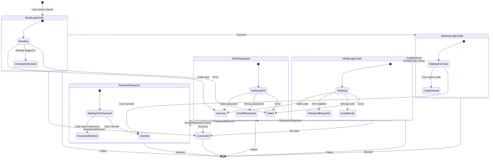
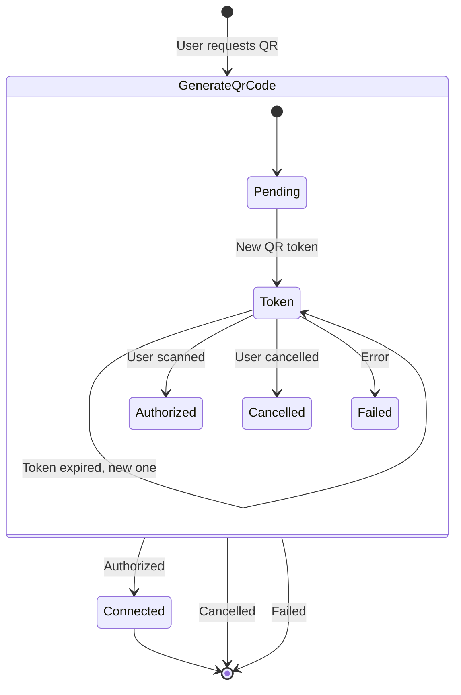
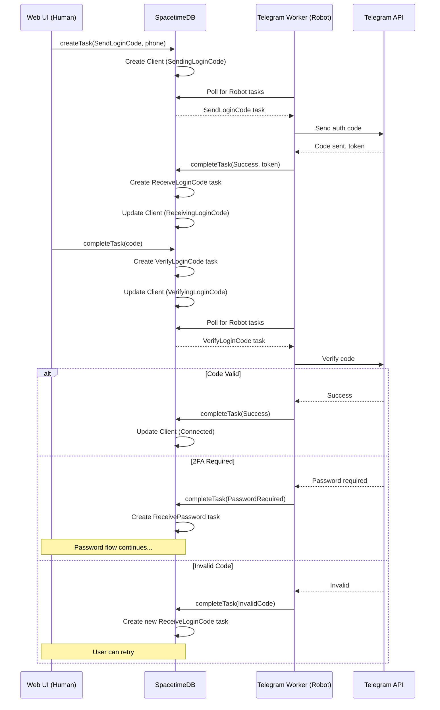
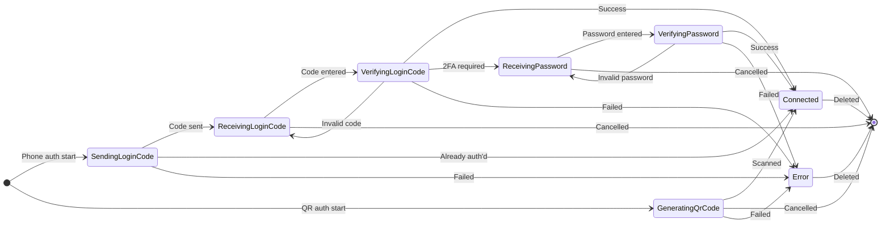

# CRM Chat - Task-Based Authentication Flow

## Overview

The SpacetimeDB server uses a task-based architecture where tasks flow between **Human** (web UI) and **Robot** (telegram-subscriber worker) processors.

## Task Types

| Task | Type | Description |
|------|------|-------------|
| `SendLoginCode` | Robot | Sends SMS code to phone number |
| `ReceiveLoginCode` | Human | User enters received code |
| `VerifyLoginCode` | Robot | Verifies code with Telegram |
| `ReceivePassword` | Human | User enters 2FA password |
| `VerifyPassword` | Robot | Verifies 2FA password |
| `GenerateQrCode` | Robot | Generates QR codes for scanning |
| `DisplayMessage` | Human | Shows notification to user |

## Phone Authentication Flow



## QR Code Authentication Flow



## Sequence Diagram - Phone Auth



## Client Status State Machine



## Architecture Overview

```
┌─────────────────────────────────────────────────────────────────┐
│                        Web UI (React)                           │
│  ┌─────────────┐  ┌─────────────┐  ┌─────────────────────────┐  │
│  │ QR Code     │  │ Phone Input │  │ Code/Password Input     │  │
│  │ Component   │  │ Component   │  │ Components              │  │
│  └──────┬──────┘  └──────┬──────┘  └───────────┬─────────────┘  │
│         │                │                      │                │
│         └────────────────┴──────────────────────┘                │
│                          │                                       │
│                   SpacetimeDB SDK                                │
└──────────────────────────┼───────────────────────────────────────┘
                           │
                           ▼
┌─────────────────────────────────────────────────────────────────┐
│                    SpacetimeDB Server                           │
│  ┌─────────────────────────────────────────────────────────┐    │
│  │                     Tasks Table                          │    │
│  │  ┌───────────┬──────────┬────────────────┬──────────┐   │    │
│  │  │ id        │ owner    │ payload        │ status   │   │    │
│  │  ├───────────┼──────────┼────────────────┼──────────┤   │    │
│  │  │ uuid-1    │ human-1  │ SendLoginCode  │ Assigned │   │    │
│  │  │ uuid-2    │ human-1  │ ReceiveCode    │ Pending  │   │    │
│  │  └───────────┴──────────┴────────────────┴──────────┘   │    │
│  └─────────────────────────────────────────────────────────┘    │
│                                                                  │
│  Reducers: createTask, completeTask, cancelTask, updateTask     │
└──────────────────────────┬───────────────────────────────────────┘
                           │
                           ▼
┌─────────────────────────────────────────────────────────────────┐
│                  Telegram Subscriber (Robot)                    │
│  ┌─────────────────────────────────────────────────────────┐    │
│  │  Task Executor                                           │    │
│  │  • Polls SpacetimeDB for Robot tasks                    │    │
│  │  • Executes Telegram API calls                          │    │
│  │  • Updates task output via completeTask                 │    │
│  └─────────────────────────────────────────────────────────┘    │
│                          │                                       │
│                          ▼                                       │
│  ┌─────────────────────────────────────────────────────────┐    │
│  │  grammers (Telegram MTProto Client)                     │    │
│  └─────────────────────────────────────────────────────────┘    │
└─────────────────────────────────────────────────────────────────┘
```
